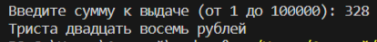
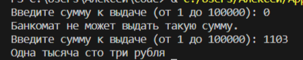
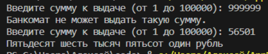
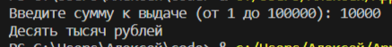

# Applied Coding 4
## Исполнитель    
Фадеев Алексей    
группа ФТ-220007    
## Лабораторная работа №4       
***Операторы выбора if/else/case - Банкомат***    
    
Написать на любом языке программу: пользователь вводит число от 1 до 100 000 (сумму выдачи в банкомате). Необходимо вывести на экран словами введенную сумму и в конце написать название валюты (рубли) с правильным окончанием.    
Например: 7431 – семь тысяч четыреста тридцать один рубль, 2149 – две тысячи сто сорок девять рублей, 15 – пятнадцать рублей, 3 – три рубля.    
Задание со звездочкой: первое слово с большой буквы.    
## Среда разработки    
Язык программирования: Python.    
Среда разработки: Visual Studio Code.    
## Инструкция по работе    
Входные данные: число от 1 до 100000.    
Выходные данные: введённое число словами + "рубль" с правильным окончанием.  
## Тесты    
Тест 1    
    
Тест 2    
    
Тест 3    
    
Тест 4    
  
